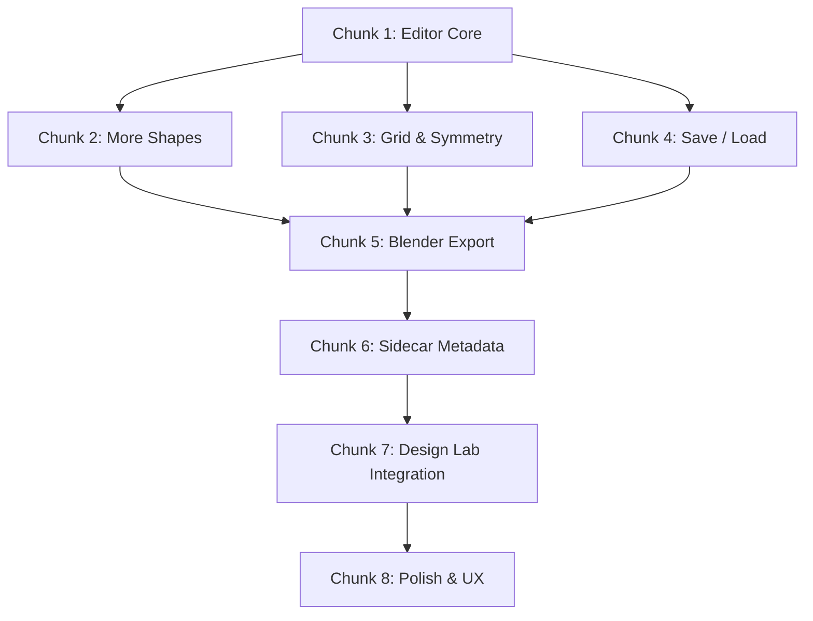

# Hull Builder Plan

> **Update 2026-08-09: Completed.** (All tasks in this plan have been fully implemented to satisfaction. This document is retained for historical context.)

**Status:** Chunk 5 (export/bake) implemented, as an in-engine SDF + Marching Cubes bake rather than the originally-planned Blender subprocess — see that chunk for what actually shipped. Chunks 1-4 and 6-8 remain planning-only; work through them in order, each is self-contained and testable.

**Goal:** Let the player build a custom hull from primitive shapes (box, sphere, cylinder, wedge, cone, torus), bake the assembly into a single fused mesh, and register that mesh + sidecar metadata in `user://mods/hulls/` so it appears in the Design Lab parts catalog as a selectable hull — exactly like the built-in procedural hulls, but player-authored. Overlapping primitives blend smoothly (signed-distance-field smooth-min + Marching Cubes polygonization) rather than sitting as interpenetrating shells.

---

## Where things stand today

[hull_builder.gd](prototype/scripts/hull_builder.gd) (670 lines) is partially implemented:

| Working | Partially / Stub | Missing |
|---------|-------------------|---------|
| Primitive palette (6 shapes, drag-from-palette and click-to-place) | Properties panel (position/rotation/scale spinboxes, random-click color) | Undo / redo |
| Surface-snapping (first prim on grid, subsequent on existing prim surfaces) | Keyboard mode switching (G/R/S) with mouse-delta drag — functional but no gizmo visual | Duplicate / delete individual primitives |
| StaticBody3D + collision for raycasting | Preview ghost (transparent gold) | Mirror / symmetry mode |
| Grid floor with collision | Status bar messages | Save / load hull assembly (JSON) |
| Back to menu, Clear All | | |
| Export via SDF + Marching Cubes bake (Chunk 5, done) | | |
| `.json` sidecar generation (Chunk 5, done) | | |
| Registration in Design Lab catalog (Chunk 5/7, `.res` path done — `parts_menu.gd` domain-sort in 7b still open) | | |

The [HullBuilder.tscn](prototype/scenes/HullBuilder.tscn) scene has the skeleton UI: left panel (primitives palette), right panel (properties), bottom bar (status + Clear + Export + Smoothness slider + Bake Quality dropdown), designer camera, grid floor, `HullContainer` node.

### Key integration points

- **Mesh loading:** [mesh_asset_loader.gd](prototype/scripts/mesh_asset_loader.gd) — loads a baked `.res` mesh or `.glb` from `res://assets/models/hulls/` or `user://mods/hulls/`, caches, supports runtime glTF import
- **Hull metadata:** `.json` sidecar files alongside the mesh (e.g. [medium_hull.json](prototype/assets/models/hulls/medium_hull.json)) — carries `name`, `hp`, `weight`, `metal`, `crystal`, `size`, `color`, etc.
- **Design Lab registration:** [hull_loader.gd](prototype/scripts/hull_loader.gd) discovers sidecars → [module_catalog.gd](prototype/scripts/module_catalog.gd) exposes hull data → [parts_menu.gd](prototype/scripts/parts_menu.gd) lists hulls in sidebar → [module_placer.gd](prototype/scripts/module_placer.gd) loads hull into viewport
- **Bake pipeline:** [sdf_mesh_baker.gd](prototype/scripts/sdf_mesh_baker.gd) + [mc_tables.gd](prototype/scripts/mc_tables.gd) — in-engine, no external Blender dependency for player-authored hulls. The built-in hulls' own Blender pipeline ([prototype/tools/blender/build_meshes.py](prototype/tools/blender/build_meshes.py)) is separate and untouched.
- **Gizmo system:** [gizmo_3d.gd](prototype/scripts/gizmo_3d.gd) + [gizmo_handle.gd](prototype/scripts/gizmo_handle.gd) + [gizmo_rotate_ring.gd](prototype/scripts/gizmo_rotate_ring.gd) — translate/rotate/scale handles used in Design Lab but **not yet in Hull Builder**

---

## Chunk 1 — Solidify the Editor Core

> **Goal:** Make the primitive editor feel like a real tool — delete, duplicate, reuse the gizmo system, and get the UI into a consistent state.

### 1a. Delete & duplicate primitives

- Add a **Delete** button (or `DEL` key) that removes the selected primitive from the `primitives` array and frees its node
- Add a **Duplicate** button (or `Ctrl+D`) that clones the selected primitive with a small offset
- Update `_update_properties_panel()` to show delete/duplicate buttons when a primitive is selected

### 1b. Integrate the existing gizmo system

The Hull Builder currently has its own inline drag-transform code (G/R/S keys + mouse delta, lines 118–398). The Design Lab already has a proper 3-axis gizmo ([gizmo_3d.gd](prototype/scripts/gizmo_3d.gd)) with colored axis handles and rotation rings. Reuse it:

- Instance `Gizmo3D.tscn` as a child of the selected primitive's `StaticBody3D`
- Wire `gizmo_handle.drag_started` / `drag_delta` / `drag_ended` signals to update the primitive's position/rotation/scale
- Remove the inline drag code (the G/R/S mouse-delta logic) — keep the G/R/S keys as mode-switch shortcuts that call `gizmo.set_mode()`
- The gizmo's `_paint_handles()` already gives red/green/blue per-axis, unshaded + no depth test — it will work as-is

### 1c. Improve the properties panel

- Replace the random-click color swatch with a proper `ColorPickerButton`
- Add per-axis scale spinboxes (current scale is uniform via mouse drag — expose independent X/Y/Z)
- Show the primitive type name and index (`"Box #3"`) for clarity
- Wire spinbox changes to update the gizmo position too (bidirectional sync)

### 1d. Selection highlighting

- When a primitive is selected, tint its material to a highlight color (or add an outline shader)
- When clicking empty space (not a primitive, not the grid), deselect (`selected_primitive = -1`)
- Show "nothing selected" in the properties panel

### Verification
- Can add 5+ primitives, select each, see the gizmo appear, drag on each axis
- Delete removes the correct primitive, duplicate creates a copy at an offset
- Properties panel stays in sync with gizmo drags

---

## Chunk 2 — Primitive Shape Expansion

> **Goal:** Provide enough geometric vocabulary for interesting hull construction, including shapes that are hard to improvise from just boxes.

### 2a. Add more primitive types

Extend the `PrimitiveType` enum and `primitive_defs` array with:

| Shape | Godot Mesh | Why |
|-------|-----------|-----|
| **Hemisphere** | `SphereMesh` (half, via material cull or geometry) | Domes, turret caps, cockpit blisters |
| **Capsule** | `CapsuleMesh` | Fuselages, rounded hulls |
| **Trapezoid / Frustum** | `BoxMesh` + vertex deform, or a small ArrayMesh helper | Tapered armour plates, hull tubs that widen toward the base |
| **L-beam / T-beam** | CSG or ArrayMesh helper | Structural framing, internal ribs |
| **Ramp / Slope** | `PrismMesh` with different proportions | Glacis plates, ramps |

### 2b. Per-shape default sizes

Not every primitive should start at 1×1×1. Give each shape a sensible default that reads as a vehicle-scale part:
- Box: 1×1×1 (current, fine)
- Cylinder: radius 0.5, height 1.5 (tall)
- Wedge: 1×0.5×1.5 (long and low, reads as a glacis plate)
- Sphere: radius 0.6 (slightly larger than a unit box to match volume)

### 2c. Collision shape accuracy

Currently the torus uses a sphere collider (line 501-503). Improve:
- Torus → `ConvexPolygonShape3D` from the mesh surface
- Wedge (PrismMesh) → `ConvexPolygonShape3D` for accurate triangle picks
- This makes raycasting/snapping more precise

### Verification
- Palette shows all new shapes, each is placeable and selectable
- Snapping to torus/wedge surfaces works correctly with accurate collision

---

## Chunk 3 — Grid, Snapping & Symmetry

> **Goal:** Precision placement tools that let users build symmetric, aligned hulls without fighting the editor.

### 3a. Configurable grid snapping

- Add a **Snap** toggle button in the bottom bar (currently `snap_enabled` exists but has no UI toggle)
- Add a **Grid Size** dropdown (0.25 / 0.5 / 1.0 / 2.0 meters)
- Snap position to grid increments when enabled
- Rotation snap: 15° / 45° / 90° increments (hold `Shift` while rotating for fine, `Ctrl` for coarse)

### 3b. X-axis mirror / symmetry mode

Hull building almost always needs bilateral symmetry. Add a **Mirror X** toggle:

- When enabled, placing or moving a primitive on one side of the X=0 plane automatically creates/moves a mirrored copy on the other side
- Mirrored primitives are visually linked (e.g. dashed line, or a subtle tint difference)
- Editing the scale of a mirrored primitive applies to its pair
- Deleting one side offers "Delete mirrored pair?" confirmation

### 3c. Visual grid improvements

- Draw grid lines on the floor (the current grid is a single semi-transparent plane — add `ImmediateMesh` or a shader-based grid with axis-colored center lines)
- Add optional side/front grid planes for vertical alignment
- Grid fades at distance for visual clarity

### Verification
- Place a box at (1, 0, 2) with snap = 0.5 → snaps to grid
- Enable mirror, place a cylinder at (2, 0, 0) → mirrored cylinder appears at (-2, 0, 0)
- Moving one mirror updates the other in real time

---

## Chunk 4 — Save & Load Hull Assemblies

> **Goal:** Persist work-in-progress hull assemblies so the user can close and return to continue building.

### 4a. Hull assembly JSON format

Define a `hull_assembly.json` schema (distinct from the hull *sidecar* `.json` — this is the editable source, not the final metadata):

```json
{
  "schema_version": 1,
  "hull_name": "My Custom Hull",
  "primitives": [
    {
      "type": "BOX",
      "position": [0, 0, 0],
      "rotation": [0, 0, 0],
      "scale": [2, 1, 3],
      "color": [0.7, 0.7, 0.8, 1.0],
      "mirror_id": null
    }
  ]
}
```

### 4b. Save / load buttons

- Add **Save** and **Load** buttons to the bottom bar (or a menu)
- Save writes to `user://hull_assemblies/<hull_name>.json`
- Load opens a file dialog listing saved assemblies
- The assembly name is editable via a `LineEdit` in the top bar

### 4c. Auto-save on exit

- When the user clicks "Back to Menu", prompt to save unsaved changes
- Store a `_dirty` flag that's set whenever any primitive is added/moved/deleted

### Verification
- Build a 5-primitive hull, save it, clear, load it back — all positions/rotations/scales/colors match
- Close and reopen the scene → can load the saved assembly

---

## Chunk 5 — Export Pipeline: SDF + Marching Cubes bake (superseded the Blender plan)

> **Status: implemented**, and implemented differently than originally planned below (kept for history). The Blender subprocess approach was replaced with an in-engine bake so custom hulls work with no external Blender dependency (needed for a shipped build) and so overlapping primitives genuinely fuse (smooth-min blend) instead of just sitting as interpenetrating shells.

**What actually shipped:**
- [sdf_mesh_baker.gd](prototype/scripts/sdf_mesh_baker.gd) — treats each primitive as a signed distance field, combines them with a polynomial smooth-min (`Smoothness` slider, 0 = hard union), and polygonizes the result with Marching Cubes ([mc_tables.gd](prototype/scripts/mc_tables.gd)'s standard 256-entry tables) on a voxel grid sized to the assembly's AABB (`Bake Quality` dropdown: Low/Medium/High → 24/32/48 voxels along the longest axis).
- `hull_builder.gd`'s `_on_export_confirmed()` calls `SDFMeshBaker.bake()`, saves the resulting `ArrayMesh` directly via `ResourceSaver.save()` to `user://mods/hulls/<name>.res`, and writes the `.json` sidecar to the same directory — no Blender process, no `.glb`, no intermediate JSON handoff file.
- No UVs/tangents are generated — the hull faction shader (`hull_faction_material.gdshader`) is fully world-space triplanar and reads no mesh UV/TANGENT data at all, so this isn't a gap, just unnecessary work skipped.
- `mesh_asset_loader.gd`'s `get_hull_mesh()` and `hull_loader.gd`'s shape-sanity warning both learned to recognize a sibling `.res` alongside/instead of a `.glb`.
- `tools/blender/bake_custom_hull.py` (the script sketched below) was removed — it's dead code now that the bake happens in-engine.

### Verification
- Build a 3+ primitive hull with Smoothness > 0, click Export Hull, fill in the stats dialog — no `blender.exe` process is ever launched.
- `user://mods/hulls/<name>.res` and `.json` exist immediately after export.
- The hull appears in the Design Lab catalog and loads via `MeshAssetLoader.get_hull_mesh()`'s new `.res` branch, with fillets visible where primitives overlapped (compare against Smoothness = 0).

<details>
<summary>Original Blender-based plan (not implemented — kept for context)</summary>

**Goal:** Bake the primitive assembly into a single unified `.glb` mesh using Blender headlessly.

**5a.** Serialize primitives to an intermediate JSON, written to a temp path Blender would read.

**5b.** A `tools/blender/bake_custom_hull.py` script would read that JSON, recreate each primitive in Blender, join them, optionally boolean-union, decimate, recalculate normals, and export `.glb`.

**5c.** `hull_builder.gd` would shell out via `OS.create_process()` to the bundled `UPBGE-0.30-windows-x86_64/blender.exe`, passing the script and I/O paths as arguments.

**5d.** Error handling around the subprocess (non-zero exit, missing output file).

This depended on a bundled Blender install being present at runtime, which doesn't hold in a shipped build, and only ever joined primitives rather than blending them — see the SDF/Marching-Cubes replacement above.

</details>

---

## Chunk 6 — Sidecar Metadata Generation

> **Goal:** Alongside the `.glb`, generate the `.json` sidecar that registers the hull in the game's catalog.

### 6a. Hull stats dialog

Before or after export, show a dialog where the user fills in gameplay-relevant metadata:

| Field | Type | Default | Notes |
|-------|------|---------|-------|
| `name` | string | (from assembly name) | Display name in Design Lab |
| `hp` | float | 400 | Scale with total primitive volume? |
| `weight` | float | 250 | Scale with volume |
| `metal` | int | 100 | Build cost |
| `crystal` | int | 20 | Build cost |
| `domain` | dropdown | "Ground" | Ground / Naval / Air / Static Defense |
| `color` | Color | average of primitive colors | Fallback tint |

### 6b. Auto-compute `size` from AABB

The most critical field — `size` drives collision, mount zones, weapon placement, and everything else in the Design Lab. Compute it automatically:

1. After all primitives are placed, compute the combined AABB of all primitives in `HullContainer`
2. `size = aabb.size` (the three axis extents)
3. Display the computed size in the stats dialog (editable for manual override)

### 6c. Write the sidecar

Write `<hull_name>.json` to `res://assets/models/hulls/` alongside the `.glb`:

```json
{
    "name": "My Custom Hull",
    "hp": 400,
    "weight": 250,
    "metal": 100,
    "crystal": 20,
    "size": [3.2, 1.8, 5.1],
    "color": [0.7, 0.7, 0.8, 1.0],
    "domain": "Ground",
    "base_energy": 50.0,
    "base_vision": 20.0,
    "is_foundation": false,
    "category": "hull"
}
```

This matches the exact format of existing sidecars like [the_cube.json](prototype/assets/models/hulls/the_cube.json).

### Verification
- Export a hull → both `.glb` and `.json` appear in `assets/models/hulls/`
- The `.json` has a valid `size` field matching the visual AABB
- `mesh_asset_loader.get_hull_mesh("my_hull")` returns a non-null Mesh

---

## Chunk 7 — Design Lab Integration

> **Goal:** Custom hulls appear in the Design Lab's parts menu and work identically to built-in hulls.

### 7a. Catalog discovery

[hull_loader.gd](prototype/scripts/hull_loader.gd) already scans for `.json` sidecars. Verify:

- A newly exported `my_custom_hull.json` + `my_custom_hull.glb` is picked up on next catalog load
- The `type_id` is derived from the filename stem (matches existing convention)
- The hull appears under the correct domain tab in the parts menu

### 7b. Parts menu domain sorting

[parts_menu.gd](prototype/scripts/parts_menu.gd) has a hardcoded `HULL_DOMAINS` dict. Custom hulls need to get sorted by their sidecar's `domain` field instead:

- If `hull_loader.gd` already populates a `domain` field into the catalog entry, `parts_menu.gd` should read it from there instead of the hardcoded dict
- Fall back to `"Ground"` if `domain` is missing (safe default)
- This may already be partially implemented per [HULL_MODDING_PLAN.md §4c](HULL_MODDING_PLAN.md) — check and complete

### 7c. End-to-end test

1. Open Hull Builder from the main menu
2. Build a hull from 3–5 primitives
3. Click Export → fill in stats → confirm
4. Go back to main menu → open Design Lab
5. The custom hull appears in the parts catalog under the chosen domain
6. Select it → hull loads into the Design Lab viewport with correct size, collision box, mount zones
7. Attach weapons/locomotion → the vehicle works in a skirmish

### Verification
- Custom hull appears in Design Lab parts list
- Selecting it loads the `.glb` mesh at the correct scale
- Mount zones (top/bottom/left/right/front/back) are computed from the `size` field and work correctly
- A vehicle using the custom hull can be deployed in a skirmish

---

## Chunk 8 — Polish & UX

> **Goal:** Quality-of-life improvements that make the Hull Builder feel like a finished tool.

### 8a. Undo / redo

- Implement a simple action stack (array of `{action, data}` dicts)
- Actions: add_primitive, delete_primitive, move, rotate, scale, color_change
- `Ctrl+Z` to undo, `Ctrl+Shift+Z` or `Ctrl+Y` to redo
- Cap stack at ~50 actions

### 8b. Camera improvements

- Add **focus selected** (`F` key or numpad `.`) — orbit camera pivots to selected primitive's center
- Add preset camera angles (front/side/top views) via numpad or buttons
- Show axis indicator widget in the corner (mini gizmo showing world orientation)

### 8c. Hull preview

- Add a **Preview** button that temporarily renders the hull as it will appear in the Design Lab — with the faction material, at the catalog `size`, as a single fused visual
- This helps the user see the final result before committing to a Blender export

### 8d. Visual polish

- Primitive palette: show 3D preview thumbnails instead of text icons
- Properties panel: add section headers, tooltips, better layout
- Bottom bar: show primitive count, total AABB size in real time
- Grid: animate grid line alpha based on zoom level

### 8e. Export progress & feedback

- Show a proper progress dialog during Blender export (not just a status bar message)
- After successful export, offer "Open in Design Lab" shortcut
- Show a thumbnail of the baked mesh

---

## Chunk summary & dependency graph



> [!TIP]
> **Chunks 1–4 are independent of each other** and can be worked on in any order (or in parallel). They all converge at Chunk 5 (export), which needs the shapes, snapping, and save/load to be in place. Chunks 6 and 7 are sequential — you need the sidecar before the Design Lab can discover the hull.

---

## Files that will be created or modified

### New files
| File | Purpose |
|------|---------|
| `prototype/tools/blender/bake_custom_hull.py` | Blender headless script — reads assembly JSON, builds mesh, exports `.glb` |
| `user://hull_assemblies/*.json` | Saved hull assembly files (WIP, not final export) |

### Modified files
| File | Changes |
|------|---------|
| [hull_builder.gd](prototype/scripts/hull_builder.gd) | All editor functionality — gizmo integration, delete/duplicate, save/load, export pipeline, stats dialog, undo/redo |
| [HullBuilder.tscn](prototype/scenes/HullBuilder.tscn) | UI additions — save/load/snap/mirror/name buttons, stats dialog, progress overlay |
| [parts_menu.gd](prototype/scripts/parts_menu.gd) | Read `domain` from catalog entry instead of hardcoded `HULL_DOMAINS` dict for custom hulls |
| [hull_loader.gd](prototype/scripts/hull_loader.gd) | Ensure `domain` field is carried through from sidecar to catalog entry |

### Files that should NOT need changes
| File | Why |
|------|-----|
| [mesh_asset_loader.gd](prototype/scripts/mesh_asset_loader.gd) | Already handles arbitrary `.glb` files and runtime glTF import |
| [module_placer.gd](prototype/scripts/module_placer.gd) | Hull loading is fully data-driven from catalog `size` field |
| [module_catalog.gd](prototype/scripts/module_catalog.gd) | Hull entries are discovered from sidecar files, not hardcoded |
| [designer_camera.gd](prototype/scripts/designer_camera.gd) | Already used by Hull Builder, no changes needed |
| [gizmo_3d.gd](prototype/scripts/gizmo_3d.gd) | Reused as-is from Design Lab |

---

## Open questions

1. **Boolean union vs. interpenetrating volumes?** The existing hull system (HULL_MASSING_SPEC) explicitly uses interpenetrating convex hulls with no boolean union. Should the Hull Builder's Blender export do the same (just join without boolean = interpenetrating shells, like `build_tower_hull`)? Or should it offer a "clean merge" option that boolean-unions everything into one manifold mesh? The former is simpler and matches existing art direction; the latter is cleaner but risks non-manifold geometry.

2. **Export destination: `res://` vs `user://`?** In a shipped build, `res://` is read-only (packed into `.pck`). For development this is fine, but for a player-facing feature, custom hulls should go to `user://mods/hulls/` (which `mesh_asset_loader.gd` already checks). Should the export path be configurable, or always target `user://mods/hulls/` for safety?

3. **Auto-computed stats vs. manual?** Should `hp`, `weight`, `metal`, `crystal` be auto-calculated from the total volume of the primitive assembly (more volume → more HP/weight/cost)? Or purely manual entry? A hybrid (auto-suggest, user-overridable) is probably best.

4. **Max primitive count.** Currently `max_primitives = 50`. Is this enough? Too many? Should it be tied to the Blender export performance (more prims → longer bake)?

5. **Naming collision guard.** If the user names their hull `medium_hull`, it would overwrite the built-in. Add a check against existing built-in hull IDs and reject/warn?

